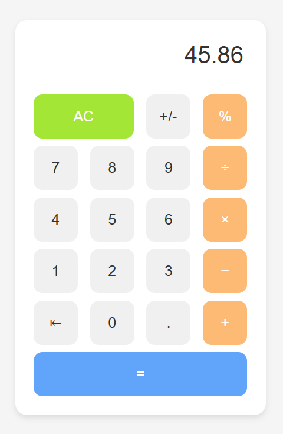

# Calculator Project

This is a **Calculator** project built as part of [The Odin Project](https://www.theodinproject.com/) Foundations curriculum. The project focuses on combining JavaScript, HTML, and CSS to create a functional and interactive calculator.

## Features

- Performs basic arithmetic operations: addition, subtraction, multiplication, and division.
- Fully functional numeric keypad with clear (`C`) and backspace (`←`) options.
- Handles both integer and decimal numbers.
- Keyboard support for input.
- Responsive design for usability on desktop and mobile devices.
- Error handling for invalid operations (e.g., division by zero).

## Project Preview



Try the live version of the project here: [Live Preview](https://gonalgar.github.io/calculator/)

## Technologies Used

- **HTML5**: Structure of the calculator interface.
- **CSS3**: Styling for a clean, modern design and responsive layout.
- **JavaScript (ES6)**: Logic for calculations, user interactions, and keyboard input handling.

## Getting Started

To view or modify the project locally:

1. Clone this repository:
   ```bash
   git clone https://github.com/gonalgar/calculator.git
2. Navigate to the project directory:
    ```bash
    cd calculator
3. Open the index.html file in your browser to use the calculator.
## What I Learned
- Building and styling a calculator interface using HTML and CSS.
- Writing JavaScript logic for arithmetic operations and user input validation.
- Handling keyboard events for a more user-friendly experience.
- Debugging and handling edge cases, such as division by zero or multiple decimal points.
## Acknowledgements
This project is part of [The Odin Project](https://www.theodinproject.com/paths/foundations/courses/foundations) Foundations curriculum. It was an excellent exercise in combining front-end development skills to create a functional and interactive application.

## License
This project is open-source and available under the MIT License.